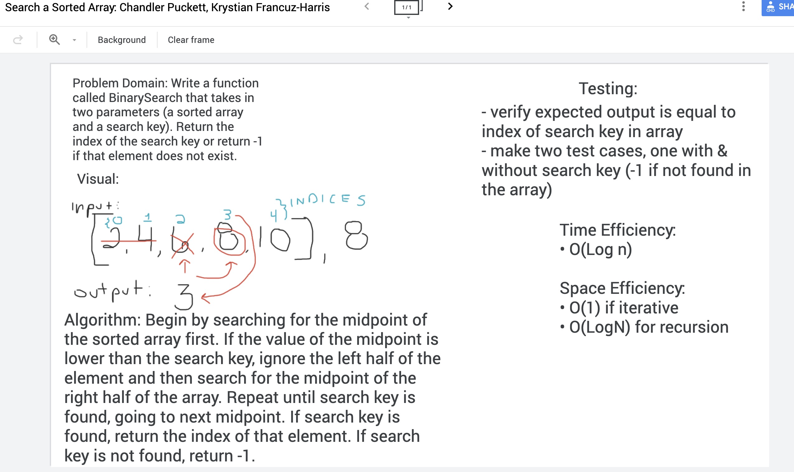

### Class 03 - Binary Search

# Binary Search in a Sorted 1D Array
Binary Search in a Sorted 1D Array

## Challenge
Write a function called BinarySearch that takes in two parameters, a sorted array and a search key, and returns the index of the search key
or -1 if search key is not found. 

## Approach & Efficiency
Begin by searching for the midpoint of the sorted array first. If the value of the midpoint
is lower than the search key, ignore the left half of the element and then search for the
midpoint of the right half of the array. Repeat until search key is found, going to next midpoint.
If search key is found, return the index of the element. If search key is not found, return -1. 

## Solution
