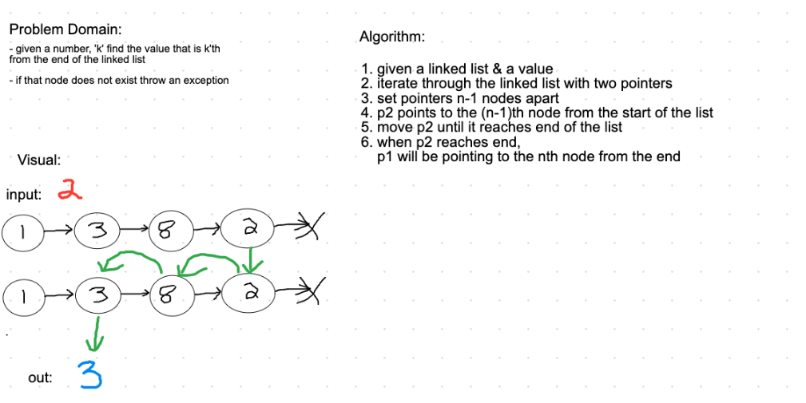

### **Class 07 - Nth From End**

### Finding Nth Value from the End of a Linked List

### Challenge
- Write a method for the Linked List class which takes a number, n, as a parameter.
- Return the node's value that is n from the end of the linked list.
- Add tests

## Approach & Efficiency

- Begin by defining 2 nodes as the head of the list, one will be a slow-traversing node, and one will be a fast-traversing node.
- Write if statements to throw errors if the value of n is a negative value, greater than the length of the list, or equal to null. 
- Write a while statement to traverse through the linked list to the end, and return the slow-traversing node's value. 

### Solution

