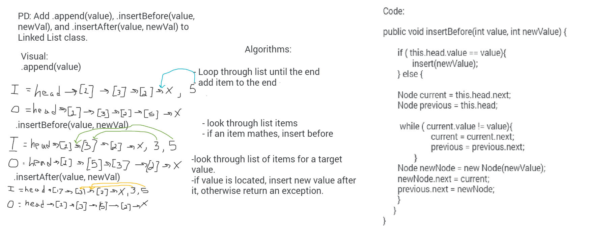

### **Class 06 - Linked List Insertions**

### Inserting Into Singly Linked Lists

### Challenge
- Create a Node class that has properties for the value stored in the Node, and a pointer to the next Node.
- Create a LinkedList class that includes a head property, which creates an empty LinkedList when instantiated.
- Define append, insertBefore, and insertAfter methods for the Linked List. 
- Add tests

## Approach & Efficiency

- Append Method
  - Create new node with a value
  - Add the new node to the end of the list

- insertBefore Method
  - Create new node with a value
  - Add new node before a given node in the list

- insertAfter Method
  - Create new node with a value
  - Add new node after a given node in the list

## Solution

