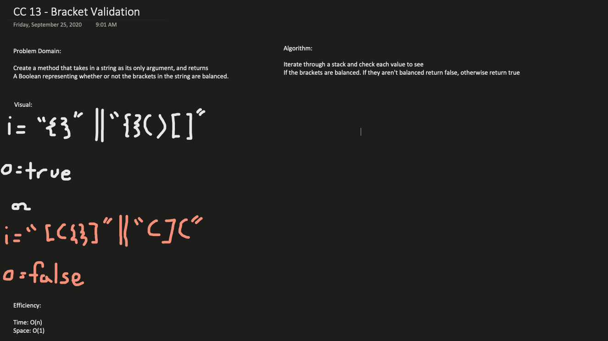

### Class 13 - Multi-Bracket Validation

### MultiBracket Validation

### Challenge

- Create a MultiBracketValidation class to validate bracket placement in a string.
- Write tests to check functionality

### Approach & Efficiency
- Create MultiBracketValidation Class
  - Write multiBracketValidation method that takes in a string as an argument, and returns a boolean representing whether or not the brackets in the string are balanced. 
  - Consider "{}", "[]", and "()"

### Solution

