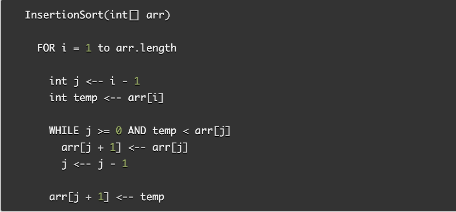
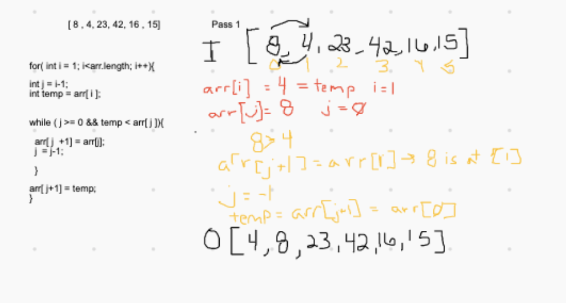
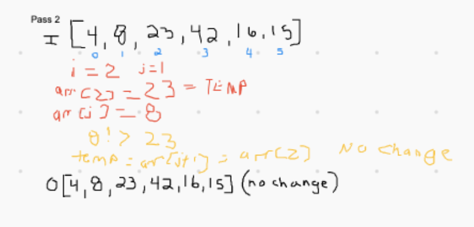
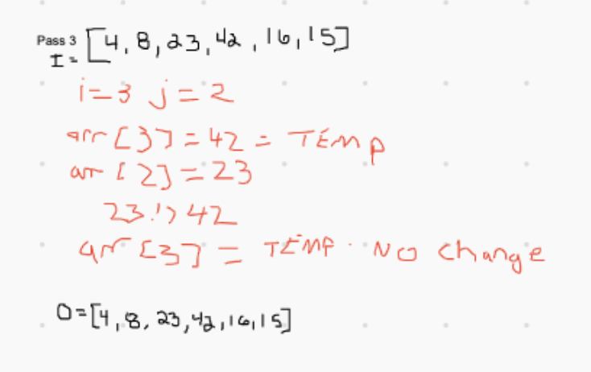
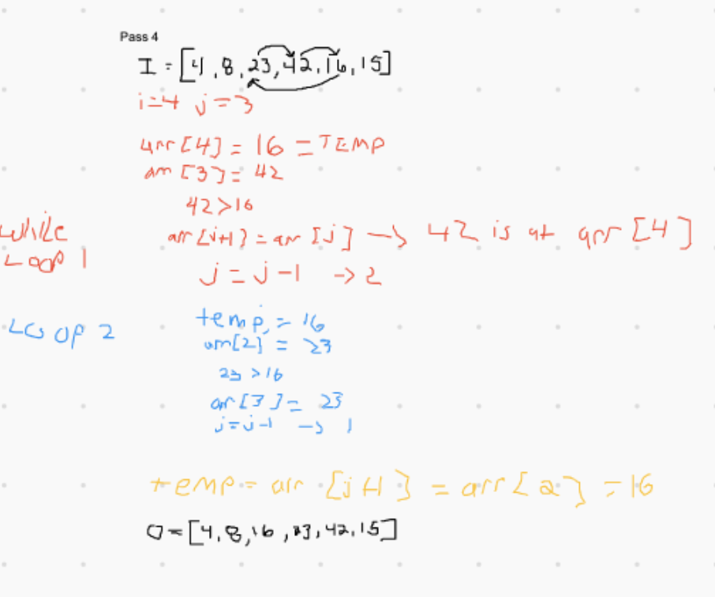
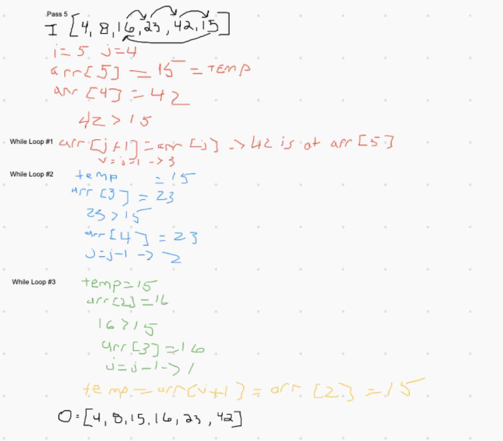

## Insertion Sort

Insertion Sorting is an algorithm that takes an array and splits it into sorted and unsorted parts. The values from the unsorted part are targeted and placed into the correct position in the sorted part of the array.

Read more about insertion sorting [HERE](https://www.geeksforgeeks.org/insertion-sort/).

### Pseudocode

### Trace

In pass one, we evaluate if the value of `arr[0]` is greater than the value of `arr [1]`, which equates to `8 > 4`, which is true. We then enter our while loop, which assigns the value of 8 to `arr[1]`. We exit our while loop, and the value of 4 is assigned to `arr[0]`.

In pass two, our iterator is set to two, and j is set to 1. We evaluate if the value of `arr[1]` is greater than `arr[2]`, which equates to `8 > 23`, which is false. We never enter our while loop and the array remains unchanged.

In pass three, we evaluate if the value of `arr[2]` is greater than the value of `arr [3]`, which equates to `23 > 42`, which is false. We never enter our while loop and the array remains unchanged.

In pass four, we evaluate if the value of `arr[3]` is greater than the value of `arr [4]`, which equates to `42 > 16`, which is true. 

We then enter our while loop, which assigns the value of `42` to `arr[4]` and assigns the value of j to `2`. 

Then, we evaluate if the value of `arr[2]` is greater than `arr[4]`, which equates to `23 > 16`, which is true. 

We re-enter our while loop, which assigns the value of `23` to `arr[3]`. 

We exit our while loop, and the value of 16 is assigned to `arr[2]`.

In pass five, we evaluate if the value of `arr[4]` is greater than the value of `arr [5]`, which equates to `42 > 15`, which is true. 

We then enter our while loop, which assigns the value of `42` to `arr[5]` and assigns the value of j to `3`. 

Then, we evaluate if the value of `arr[3]` is greater than `arr[4]`, which equates to `23 > 15`, which is true. 

We re-enter our while loop, which assigns the value of `23` to `arr[4]` and assigns the value of j to 2.

Then, we evaluate if the value of `arr[3]` is greater than `arr[2]`, which equates to `16 > 15`, which is true. 

We re-enter our while loop, which assigns the value of `16` to `arr[3]`. 

We exit our while loop, and the value of 15 is assigned to `arr[2]`.

Now the array is sorted.

### Efficiency
- time: O(n * 2)
  - the array is sorted n-1 times

- space: O(1)
  - the array is sorted in place
