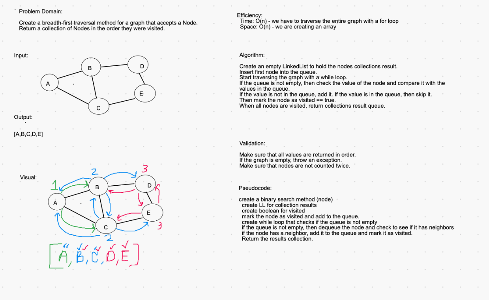

## Breadth-First Search of a Graph

In a Breadth-First Search of a graph, all of the values of the graph are recorded, without duplicates. Since graphs have several paths, it is important to check for duplicates in order to get all of the values and not have any duplicates in the result. 

Read more about breadth-first traversal of graphs [HERE](https://www.geeksforgeeks.org/breadth-first-search-or-bfs-for-a-graph/).

For the first step of the traversal, record the node taken in as visited, and add it to a LinkedList. 

Then, create a while loop that checks if the LinkedList is empty. If the LL is not empty, look at the value and set it as the iterator integer. 

Create another while loop to check if the interator integer has a neighbor. If it has a neighbor, check to see if it has been visited already. If not, assign it as visited and add it to the LL. 

Once all nodes are visited, return the LL.

### Efficiency
- time: O(n)
    - We are traversing the entire graph.
- space: O(n)
    - We are creating a LinkedList of all of the nodes in the graph. 