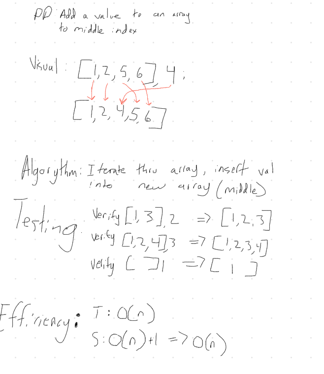

# Java Code 401 - Code Challenges

## Table of Contents

1. [__Class One:__ *Array Reverse*](ArrayReverse.java)
1. [__Class Two:__ *Array Shift*](ArrayShift.java)
1. [__Class Three:__ **]()
1. [__Class Four:__ **]()
1. [__Class Five:__ **]()
1. [__Class Six:__ **]()
1. [__Class Seven:__ **]()
1. [__Class Eight:__ **]()
1. [__Class Nine:__ **]()
1. [__Class Ten:__ **]()
1. [__Class Eleven:__ **]()
1. [__Class Twelve:__ **]()
1. [__Class Thirteen:__ **]()
1. [__Class Fourteen:__ **]()
1. [__Class Fifteen:__ **]()
1. [__Class Sixteen:__ **]()
1. [__Class Seventeen:__ **]()
1. [__Class Eighteen:__ **]()
1. [__Class Nineteen:__ **]()
1. [__Class Twenty:__ **]()
1. [__Class Twenty One:__ **]()
1. [__Class Twenty Two:__ **]()
1. [__Class Twenty Three:__ **]()
1. [__Class Twenty Four:__ **]()

## Class Notes

### Class 01 - Array Reverse

# Reverse an Array
Reverse an Array.

## Challenge
Write a function called reverseArray which takes an array as an argument.

## Approach & Efficiency
My approach was to Google references to use for reversing an array in Java. 

## Solution
There was not a whiteboard assignment for this lab. 

### Class 02 - Array Shift

# Insert and Shift an Array
Insert and shift array in middle at index

## Challenge
Write a function called insertShiftArray which takes an array as an argument and the value to be added, return an array with the new value added at the middle index.

## Approach & Efficiency
My approach was to Google references to use for inserting a value into a sorted array. 

## Solution
