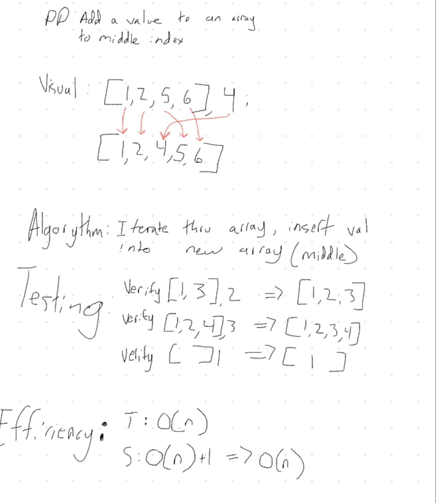

### Class 02 - Array Shift

# Insert and Shift an Array
Insert and shift array in middle at index

## Challenge
Write a function called insertShiftArray which takes an array as an argument and the value to be added, return an array with the new value added at the middle index.

## Approach & Efficiency
My approach was to Google references to use for inserting a value into a sorted array. 

## Solution
