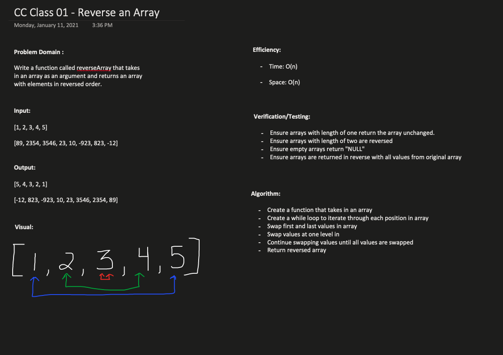

### **Class 01 - Array Reverse**

#### Reverse an Array

#### Challenge
- Write a function called reverseArray which takes an array as an argument and returns an array with elements in reversed order.

#### Approach & Efficiency
  - Create a function that takes in an array
	- Create a while loop to iterate through each position in array
	- Swap first and last values in array
	- Swap values at one level in
	- Continue swapping values until all values are swapped
  - Return reversed array 

  Time: O(n)
  Space: O(n)

#### Solution
- 