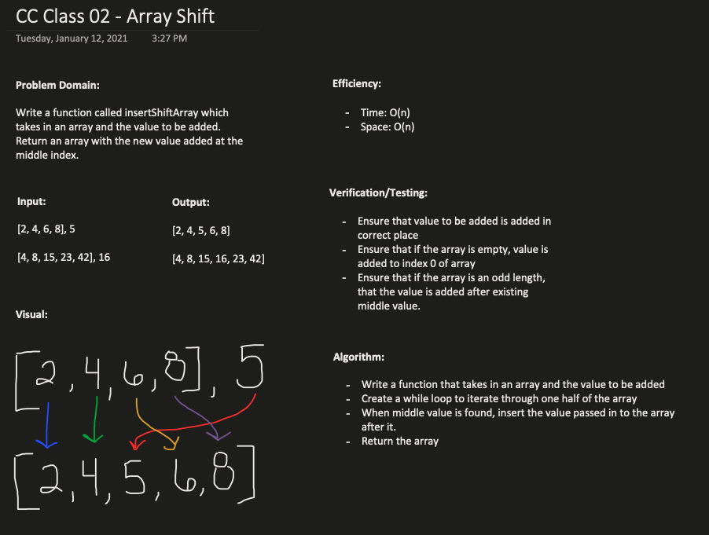

### Class 02 - Array Shift

# Insert and Shift an Array
Insert and shift array at middle index

## Challenge
Write a function called insertShiftArray which takes an array as an argument and the value to be added, return an array with the new value added at the middle index.

## Approach & Efficiency
	- Write a function that takes in an array and the value to be added
	- Create a while loop to iterate through one half of the array
	- When middle value is found, insert the value passed in to the array after it.
  - Return the array

  - Time: O(n)
  - Space: O(n)

## Solution
