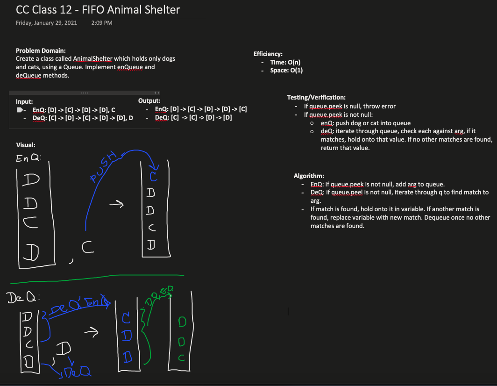

### Class 12 - Animal Shelter

### Implement a FIFO Animal Shelter

### Challenge

- Create an Animal Shelter class which holds only dogs and cats, which operates using a first-in-first-out approach.
- Write tests to check functionality

### Approach & Efficiency
- Create AnimalShelter Class
  - Enqueue(animal) Method : adds an animal (cat or dog only) to the shelter
  - Dequeue(pref) Method : returns either a dog or a cat, using a FIFO approach. If neither a dog or cat is asked for, return null.

- Create Animal class
  - Instantiate animal object with a name and type.

- Create Dog class
  - extends animal class, with name and type of "dog"

- Create Cat class
  - extends animal class, with name and a type of "cat"

### Solution

