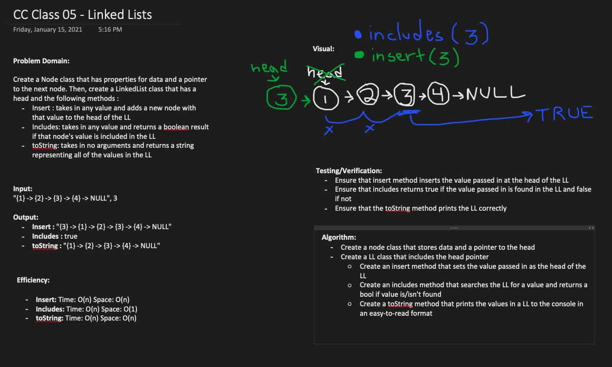

### **Class 05 - Linked List Implementation**

### Implementation of Singly Linked Lists

### Challenge
- Create a Node class that has properties for the value stored in the Node, and a pointer to the next Node.
- Create a LinkedList class that includes a head property, which creates an empty LinkedList when instantiated.
- Define insert, includes, and toString methods for the Linked List. 
- Add tests

## Approach & Efficiency

- Insert Method
  - Create new node with a value
  - Set the head to the new node's next value
  - Set the new node to the head value

- Includes Method
  - Start with the head and check to see if it matches value passed in to method.
    - if it matches, return true.
    - if it does not match, set the current to current.next and check for a match
    - if no matches are found, return false

- toString Method
  - start with current value, check to ensure it does not equal null
    - if it equals null, return null.
  - return the readable contents of the LinkedList.

### Solution

