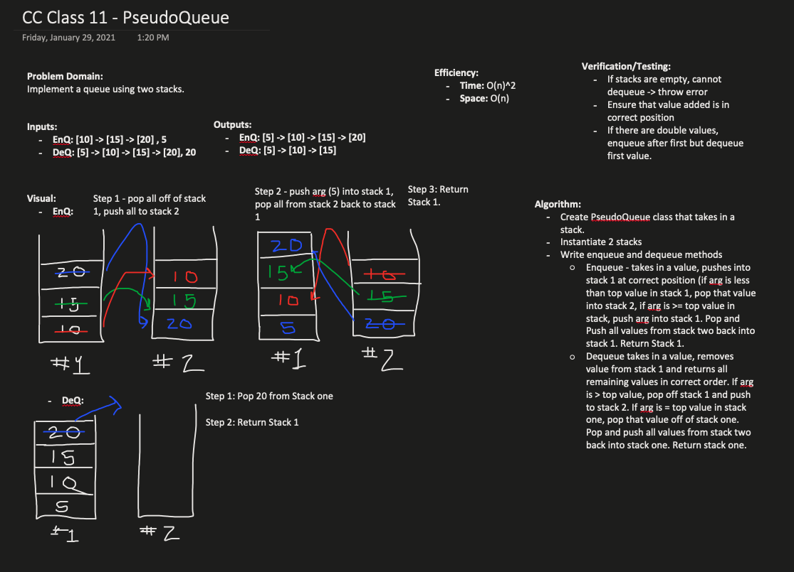

### Class 11 - Queue with Two Stacks

### Implement a Queue Using Two Stacks
##### 

### Challenge

- Create a PseudoQueue class
  - PseudoQueue implements the queue interface (from class 10), but will only use two Stack objects internally.
- Write tests to check functionality.

### Approach & Efficiency
- Create PseudoQueue Class
  - Enqueue(value) Method : inserts a value into the pseudoqueue, using a first-in-first-out (FIFO) approach
  - Dequeue Method : extracts a value from the pseudoqueue, using a FIFO approach.

- Stack Instances
  - Use previous stack implementation (from class 10)
  - Instantiate stacks in pseudocode constructor

## Solution
- 