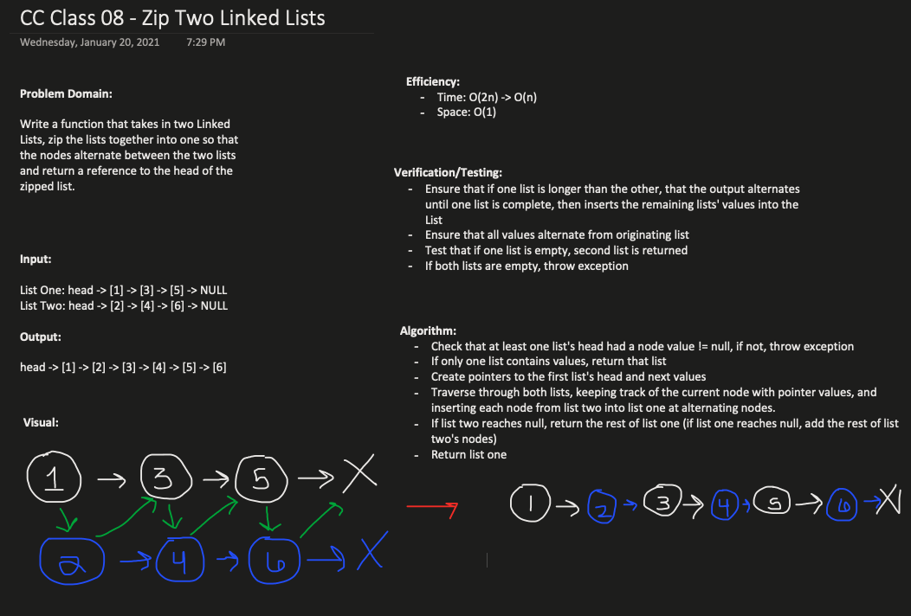

### Class 08 - Zip Two Lists

### Zip Two Linked Lists

### Challenge
- Write a function called zipLists that takes in two Linked Lists as arguments and zips them together into one so that the nodes alternate between the two lists and return a reference to the head of the zipped list. 
- Write tests to check functionality.

### Approach & Efficiency
- Begin by checking that at least one list has a node value at the head, if not throw an exception.
- If only one list has values, return that list. 
- Create pointers to the first list's head and next values. Begin traversing through list one and list two, keeping track of the current node with pointer values and inserting each node from list two into list one at alternating nodes. If list two reaches null, return the rest of list one. If list one reaches a null node first, add the rest of list two's nodes.
- Return list one, now zipped with alternating nodes from list two. 

### Solution

